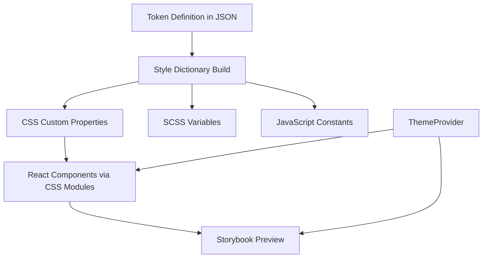

# Tagaddod Design System Architecture

This document details the complete architecture of the Tagaddod Design System, from the definition of primitive tokens to their consumption in React components and the build process.

## 1. System Overview



## 2. Token Definition Architecture

### 2.1 Token Source Files Structure

```
packages/tokens/
├── src/
│   ├── core/              # Primitive tokens (raw values)
│   │   ├── color.tokens.json
│   │   ├── space.tokens.json
│   │   ├── size.tokens.json
│   │   ├── borderRadius.tokens.json
│   │   └── borderWidth.tokens.json
│   ├── semantic/          # Semantic/alias tokens
│   │   ├── color.semantic.json
│   │   └── border.semantic.json
│   ├── extras/            # Additional token categories
│   │   └── ...
│   ├── brands/            # Brand-specific overrides
│   │   ├── tagaddod/
│   │   │   └── overrides/
│   │   └── greenpan/
│   │       └── overrides/
│   │           └── color.tokens.json
│   └── locales/           # Locale-specific tokens
│       ├── en/
│       └── ar/
├── style-dictionary.config.cjs  # Main build config
├── sd.config.mjs                # Brand-specific build
└── package.json
```

### 2.2 Token Format (W3C Design Tokens Format)

Tokens in Tagaddod Design System follow the W3C Design Tokens Format using `$value` and `$type` properties:

**Primitive Token Example (packages/tokens/src/core/color.tokens.json)**:
```json
{
  "color": {
    "purple": {
      "1200": {
        "$value": "#8c34ff",
        "$type": "color"
      }
    }
  }
}
```

**Semantic Token Example (packages/tokens/src/semantic/color.semantic.json)**:
```json
{
  "color": {
    "text": {
      "primary": {
        "$value": "{color.gray.1600}",
        "$type": "color"
      }
    }
  }
}
```

**Brand Override Example (packages/tokens/src/brands/greenpan/overrides/color.tokens.json)**:
```json
{
  "color": {
    "green": {
      "1200": {
        "$value": "f1f1f1", 
        "$type": "color"
      }
    }
  }
}
```

## 3. Token Build Process

### 3.1 Style Dictionary Configuration

The token build process uses Style Dictionary with W3C transforms from the `@tokens-studio/sd-transforms` package:

**Main Configuration (style-dictionary.config.cjs)**:
```javascript
const { w3c } = require('@tokens-studio/sd-transforms');

module.exports = {
  source: ['src/**/*.json'],
  platforms: {
    css: {
      transforms: [...w3c.transformGroupCss, 'name/cti/kebab'],
      buildPath: 'dist/css/',
      files: [{
        destination: 'tokens.css',
        format: 'css/variables',
        options: { 
          outputReferences: true, 
          selector: ':root', 
          prefix: 't'  // Creates --t-color-green-500
        }
      }]
    },
    scss: { /* SCSS output */ },
    js: { /* JavaScript output */ }
  }
};
```

### 3.2 Build Output Files

After running `yarn build:tokens`, these files are generated:

```
packages/tokens/dist/
├── css/
│   └── tokens.css         # CSS variables with --t- prefix
├── scss/
│   └── _tokens.scss       # SCSS variables 
├── index.js               # JavaScript exports
├── tokens.js              # Alternative JS format
├── tagaddod/
│   ├── vars.css           # Base Tagaddod brand variables
│   ├── en/
│   │   └── vars.css       # Tagaddod + English variables
│   └── ar/
│       └── vars.css       # Tagaddod + Arabic variables
└── greenpan/
    ├── vars.css           # Base GreenPan brand variables
    ├── en/
    │   └── vars.css       # GreenPan + English variables
    └── ar/
        └── vars.css       # GreenPan + Arabic variables
```

**Sample CSS Output (dist/css/tokens.css)**:
```css
:root {
  --t-color-purple-1200: #8c34ff;
  --t-color-text-primary: var(--t-color-gray-1600);
  --t-border-radius-200: 8px;
  /* ... hundreds of other variables */
}
```

## 4. React Component Package

### 4.1 Architecture

```
packages/react/
├── src/
│   ├── components/
│   │   ├── Button.tsx
│   │   ├── Button.module.css
│   │   └── Button.stories.tsx
│   ├── providers/
│   │   └── ThemeProvider.tsx
│   ├── styles/
│   │   ├── index.css
│   │   ├── main.css       # Entry point for CSS
│   │   └── token-utilities.css
│   └── index.ts           # Package exports
├── scripts/
│   └── build-css.js       # CSS processing
├── postcss.config.js
└── vite.config.ts
```

### 4.2 CSS Consumption Flow

1. **Import Token CSS in React (src/styles/main.css)**:
   ```css
   /* Import design tokens */
   @import '@tagaddod/tokens/css/tokens.css';

   /* Import brand-specific tokens */
   @import '@tagaddod/tokens/tagaddod/vars.css';
   @import '@tagaddod/tokens/greenpan/vars.css';

   /* Import locale-specific tokens */
   @import '@tagaddod/tokens/locales/en/vars.css';
   @import '@tagaddod/tokens/locales/ar/vars.css';

   /* Base styles... */
   html {
     font-family: var(--t-font-family-primary);
     color: var(--t-color-text-primary);
     background-color: var(--t-color-surface-background);
   }
   ```

2. **Component CSS Module (src/components/Button.module.css)**:
   ```css
   .button {
     display: inline-flex;
     min-width: 80px;
     min-height: 48px;
     padding: var(--t-space-100) var(--t-space-300);
     border-radius: var(--t-border-radius-200);
     transition: all var(--t-duration-base) var(--t-easing-in-out);
     /* more styles... */
   }

   .primary {
     background-color: var(--t-color-bg-fill-brand);
     color: var(--t-color-text-on-brand);
   }

   /* ... other variants and states ... */
   ```

3. **React Component (src/components/Button.tsx)**:
   ```tsx
   import React from 'react';
   import clsx from 'clsx';
   import styles from './Button.module.css';

   export interface ButtonProps extends React.ButtonHTMLAttributes<HTMLButtonElement> {
     variant?: 'primary' | 'secondary' | 'success' | 'critical';
     size?: 'sm' | 'md' | 'lg';
     // other props...
   }

   export const Button: React.FC<ButtonProps> = ({
     children,
     variant = 'primary',
     size = 'md',
     // ...other props
   }) => {
     const buttonClasses = clsx(
       styles.button,
       styles[variant],
       styles[size],
       // other class conditionals...
     );
     
     return (
       <button className={buttonClasses} {...props}>
         {children}
       </button>
     );
   };
   ```

### 4.3 CSS Build Process

The React package has a specialized build process for CSS:

1. **PostCSS Configuration (postcss.config.js)**:
   - Uses `postcss-import` to resolve token imports
   - Uses `postcss-nested` for nesting support

2. **CSS Build Script (scripts/build-css.js)**:
   ```javascript
   const postcss = require('postcss');
   const postcssImport = require('postcss-import');
   const postcssNested = require('postcss-nested');

   async function buildCSS() {
     // Read the main CSS file
     const mainCssPath = path.resolve(__dirname, '../src/styles/main.css');
     const mainCss = fs.readFileSync(mainCssPath, 'utf-8');
     
     // Process with PostCSS
     const result = await postcss([
       postcssImport({
         // Resolve token imports to absolute paths
         resolve: (id, basedir) => {
           if (id === '@tagaddod/tokens/css/tokens.css') {
             return path.resolve(__dirname, '../../tokens/dist/css/tokens.css');
           }
           // resolve other token imports...
         }
       }),
       postcssNested()
     ]).process(mainCss, { 
       from: mainCssPath,
       to: path.join(path.resolve(__dirname, '../dist/styles'), 'index.css')
     });
     
     // Write output to dist/styles/index.css
     // ...
   }
   ```

## 5. Theming Architecture

### 5.1 Theme Provider

The `ThemeProvider` component manages theme state, direction, and locale:

```tsx
import React, { createContext, useContext, useEffect, useState } from 'react';

export type Theme = 'tagaddod' | 'greenpan';
export type Direction = 'ltr' | 'rtl';
export type Locale = 'en' | 'ar';

// Context and provider implementation...

export const ThemeProvider: React.FC<ThemeProviderProps> = ({
  children,
  defaultTheme = 'tagaddod',
  defaultDirection = 'ltr',
  defaultLocale,
  storageKey = 'tagaddod-theme'
}) => {
  // State management for theme, direction, locale
  // ...

  // Apply theme to document
  useEffect(() => {
    const root = document.documentElement;
    root.setAttribute('data-theme', theme);
    root.setAttribute('data-locale', locale);
    root.setAttribute('dir', direction);
    
    // Store preferences
    localStorage.setItem(storageKey, JSON.stringify({ theme, direction, locale }));
  }, [theme, direction, locale]);

  // Provider implementation...
};

// Hooks for components to consume
export const useTheme = () => {
  const context = useContext(ThemeContext);
  if (context === undefined) {
    throw new Error('useTheme must be used within a ThemeProvider');
  }
  return context;
};
```

### 5.2 Theme Switching Mechanism

1. **CSS Variable Scoping**:
   ```css
   /* Base tokens in :root */
   :root {
     --t-color-bg-fill-brand: #16161d; /* Default color for Tagaddod */
   }

   /* GreenPan brand overrides */
   [data-theme="greenpan"] {
     --t-color-bg-fill-brand: #f1f1f1; /* GreenPan override */
   }

   /* RTL support */
   [dir="rtl"] {
     /* RTL-specific overrides */
   }
   ```

2. **ThemeProvider Sets Attributes**:
   - Sets `data-theme="tagaddod|greenpan"` on root element
   - Sets `dir="ltr|rtl"` for text direction
   - Sets `data-locale="en|ar"` for locale-specific styling

3. **Component Usage**:
   - Components style themselves with CSS variables
   - CSS variables change value based on attributes
   - No JavaScript recalculation needed for theme changes

## 6. Build System Integration

### 6.1 Monorepo Structure

The project uses Turborepo for package orchestration:

```
turbo.json
↓
packages/tokens/package.json (build script)
↓
packages/react/package.json (build script, imports tokens)
↓
packages/storybook/.storybook/preview.tsx (imports React + tokens)
```

### 6.2 Build Scripts in Root package.json

```json
{
  "scripts": {
    "build": "turbo run build",
    "build:tokens": "turbo run build --filter=@tagaddod/tokens",
    "build:react": "turbo run build --filter=@tagaddod/react",
    "build:core": "node scripts/build-core.js",
    "storybook": "node scripts/start-storybook-autoport.js"
  }
}
```

### 6.3 Build Order Requirements

1. **Token Build First**: Tokens must be built first since React imports them
2. **React Build Second**: React components use token CSS variables 
3. **Storybook Last**: Storybook imports both tokens and React components

## 7. Complete Flow: From Definition to Runtime

1. **Token Definition** → JSON files define values and references
2. **Style Dictionary Build** → Transforms tokens to CSS/SCSS/JS with the `--t-` prefix
3. **React CSS Import** → React imports token CSS via PostCSS
4. **Component Styling** → Components use token variables via CSS modules
5. **Theme Provider** → Sets HTML attributes based on selected theme
6. **CSS Variable Inheritance** → CSS variables change value based on attributes
7. **Storybook Integration** → Provides UI to toggle themes, view components

## 8. Key Architecture Principles

1. **Single Source of Truth**: All design values come from token JSON files
2. **CSS-First Approach**: Theming done via CSS variables, not JS
3. **Layered Tokens**: Core → Semantic → Brand Overrides → Locale Overrides
4. **Runtime Theming**: Switch themes without code changes or rebuilding
5. **Multi-Brand Support**: GreenPan vs Tagaddod with minimal overrides
6. **RTL/Localization**: Built-in direction and locale attributes
7. **Build Dependency Chain**: Tokens → React → Storybook

This architecture ensures consistent styling across components, easy theming capability, and efficient build processes in the Tagaddod Design System.